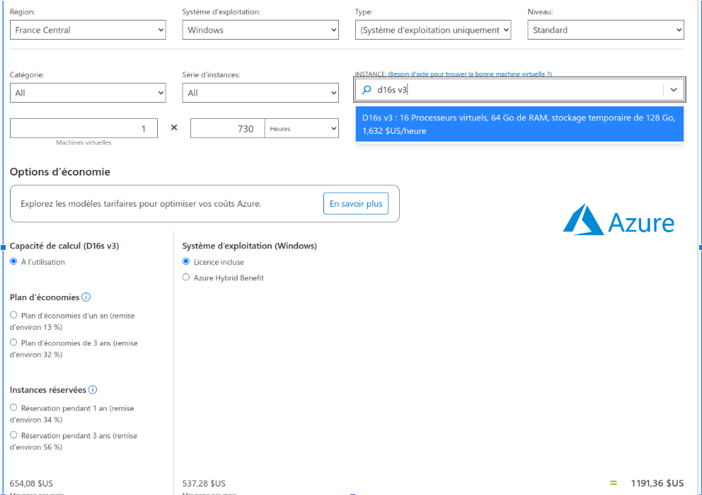
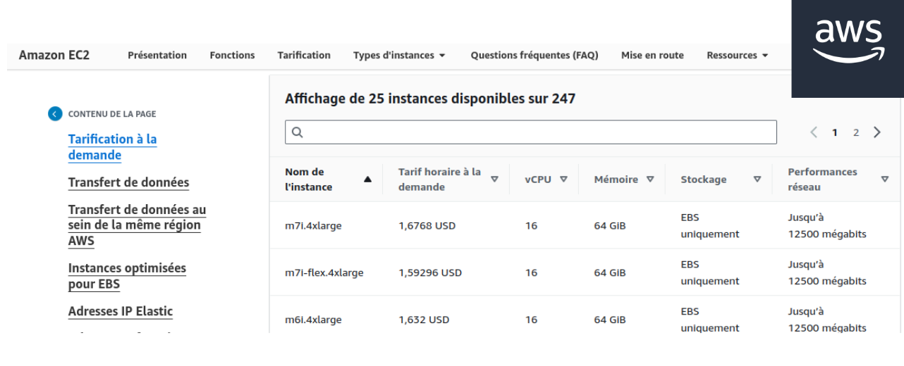
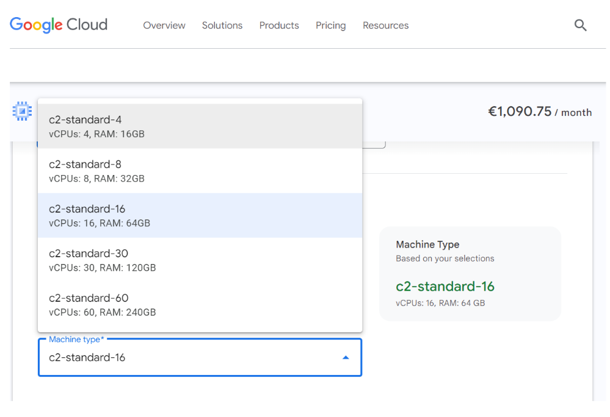
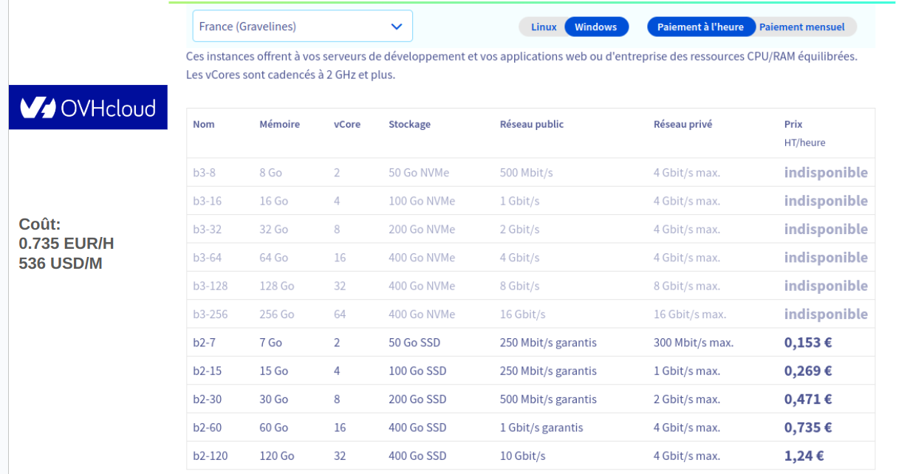

# Virtual Machine Pricing Comparison Across Cloud Services

When deploying applications on Kubernetes, choosing the right cloud provider is crucial not only for technical compatibility and feature set but also for aligning with the project's budget and existing infrastructure. While Kubernetes offers a unified orchestration layer, the underlying infrastructure costs can vary significantly between providers. Therefore, comparing the prices of Virtual Machines (VMs) equivalent, for example, to `Standard_D16s_v3` across different cloud services is essential.

  
  <figcaption> Microsoft Azure <figcaption>

   
  <figcaption> AWS <figcaption>

  
  <figcaption> Google Cloud <figcaption>

  
  <figcaption> OVH <figcaption>

## Cost Comparison

Upon reviewing the pricing for VMs provided by Azure, AWS, Google Cloud, and OVH, it's evident that costs can vary based on several factors, including region, reserved instances, and commitment periods. For a machine equivalent to `Standard_D16s_v3`, our comparison has revealed that OVH offers the most cost-effective solution for projects prioritizing budget considerations.

It's important to note that pricing and offerings can change, so we recommend conducting a detailed cost analysis based on current prices and specific project requirements before making a final decision.
