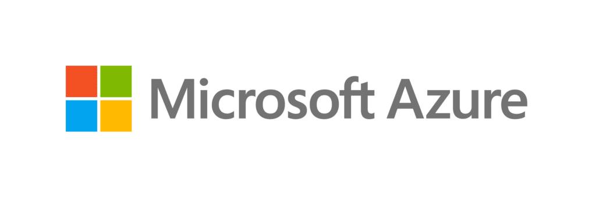
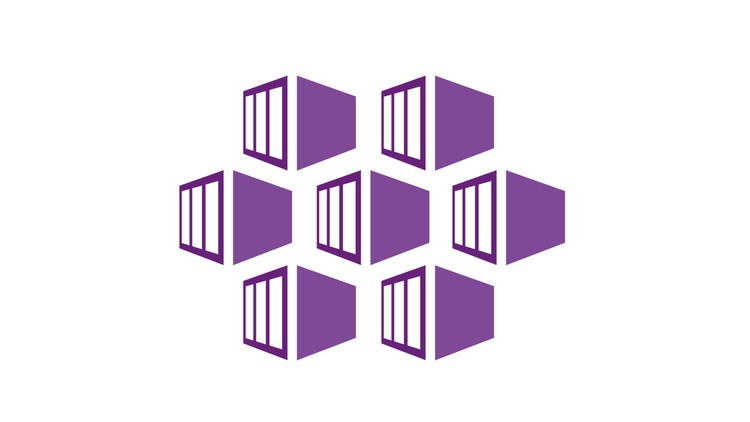

# Azure Kubernetes Service (AKS) Tutorial

<p align="center">
  
   
  
</p>

<p align="center">
  
  
  
</p>


Welcome to the tutorial on Azure Kubernetes Service (AKS) and its ecosystem, including Docker, Azure CLI, Azure Container Registry (ACR), and more. This guide provides insights into deploying and managing containerized applications on Microsoft Azure.

## Contents
- [Docker and Docker Images](#docker-and-docker-images)
- [Azure Command Line Interface (CLI)](#azure-command-line-interface-cli)
- [Azure Container Registry (ACR)](#azure-container-registry-acr)
- [Azure Kubernetes Service (AKS)](#azure-kubernetes-service-aks)
- [Application Deployment](#application-deployment)
- [Managing AKS Clusters and Node Pools](#managing-aks-clusters-and-node-pools)
- [Persistent Volumes (PV) and Persistent Volume Claims (PVC)](#persistent-volumes-pv-and-persistent-volume-claims-pvc)
- [CronJob Configuration in Kubernetes](#cronjob-configuration-in-kubernetes)
- [GitHub Actions Integration](#github-actions-integration)
- [Selecting Azure Virtual Machines and Storage](#selecting-azure-virtual-machines-and-storage)

## Docker and Docker Images
Learn the basics of Docker, a key component in containerization, and understand the importance of Docker Images for deploying your applications.

## Azure Command Line Interface (CLI)
Master Azure CLI to efficiently manage Azure resources and interact seamlessly with Azure services.

## Azure Container Registry (ACR)
Explore how ACR provides a private registry service for storing and managing Docker container images.

## Azure Kubernetes Service (AKS)
Dive into the functionalities of AKS for deploying, managing, and scaling containerized applications, including the management of Clusters, Nodes, and Pods.

## Application Deployment
Step-by-step instructions on deploying applications using Docker, Azure CLI, Kubernetes commands, and YAML configurations, along with managing Cron Jobs in Kubernetes.

## Managing AKS Clusters and Node Pools
Learn to effectively manage AKS clusters and node pools for optimal resource allocation and scalability.

## Persistent Volumes (PV) and Persistent Volume Claims (PVC)
Understand the use of PV and PVC in Kubernetes for managing the persistent storage needs of applications.

## CronJob Configuration in Kubernetes
Discover how to configure and manage CronJobs within your Kubernetes environment for task automation.

## GitHub Actions Integration
Incorporate GitHub Actions into your workflow for automated deployment and management in AKS.

## Selecting Azure Virtual Machines and Storage
Guidance on choosing the right Azure Virtual Machines and Storage options based on performance, scalability, and cost considerations.

## Sample Code Preview

Here's a sneak peek into what you'll learn in this tutorial:

### Deploying an Application in AKS
```bash
# Create a deployment in AKS using the deployment.yaml file
kubectl apply -f deployment.yaml

# Verify the deployment
kubectl get deployment my-app-deployment

# Watch the status of the pods
kubectl get pods -l app=my-app --watch
```
These commands demonstrate how to deploy your application in AKS, verify the deployment, and monitor the status of your pods.

For more detailed explanations and additional code examples, please refer to the full tutorial in the accompanying PDF document.
